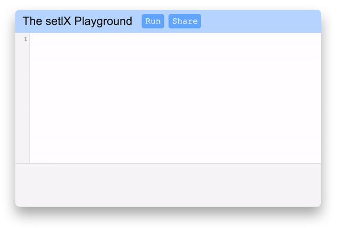

<p align="center"></p>

[](https://travis-ci.org/KeKsBoTer/setlXPlayground)

setlX Playground is a webapp that allows you to write and execute setlX code in the browser.
You can run it yourself or use the one hosted on my webserver: [Demo](https://setlx.dotcookie.me).



# Features
- ✨ Write, run and share code in the browser
- 📚 Share your code with other people
- ⚡️ Embed a code snippet into your own website
- 🔒 The code is executed in a safe java sandbox with no read or write access to the filesystem 


# Installation
There are three different methods to build and run the playground. But first you need to clone the repository:
```
$ git clone https://github.com/KeKsBoTer/setlXPlayground
```

## Run with Docker
Docker is a great tool to run the playground and even can be used to deploy it on a server.  
``` bash
# build the image
$ docker build -t setlxplayground .

# run the container
$ docker run -p 8080:80 setlxplayground
```

Or just use docker-compose
```
$ docker-compose up
```

## Use Release

You can download the latest release of the playground [here](https://github.com/KeKsBoTer/setlXPlayground/releases).
Keep in mind that releases are usually behind the master branch.
Once you downloaded a release, started it with
```bash
# (on Windows use setlxplayground.exe)
./setlxplayground -host 8080
```
To get a full description for all flags run `setlxplayground -help`

## Build it yourself
First make sure that you have [go](https://golang.org) version 1.11 or higher installed.

Then you can build the application:

**Linux/macOS**
```
$ GO111MODULE=on go build -o setlxplayground .
```
**Windows** (PowerShell)
```powershell
$ $env:GO111MODULE="on"
$ go build -o setlxplayground.exe .
```

Now the playground can be started with
```bash
# (on Windows use setlxplayground.exe)
./setlxplayground -host 8080
```
To get a full description for all flags run `setlxplayground -help`

# Code storage
Since you can share your code via a URL the application needs to store your code in a database. Setlx playground uses the key-value store [badger](https://github.com/dgraph-io/badger) for that. This means the database is managed by the application at runtime. The database's location can be specified with the `-db` flag when starting the application.
